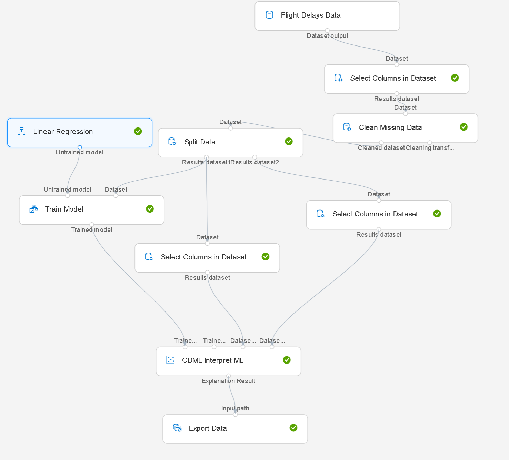
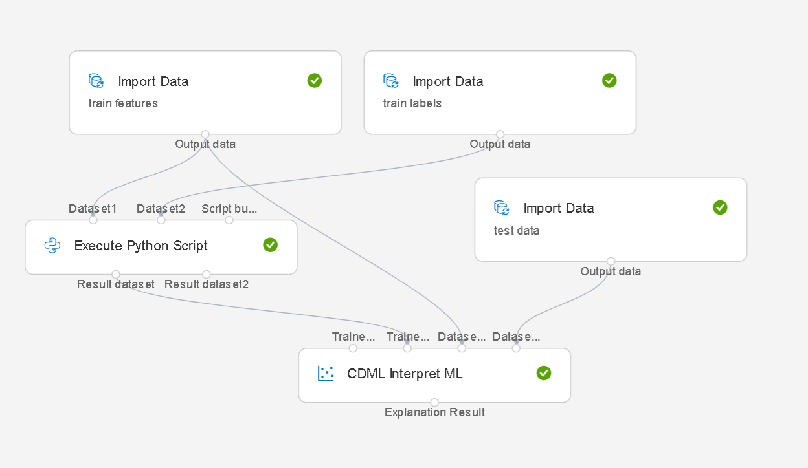

How to use 'CDML Interpret ML'?
============================

This document shows how to use the module in two use cases, and how to consume explanation result.

# Use it with official "Train Model" module
After you register the module, on AML designer you can drag & drop it to graph, and add 3 connections after "Train model":
* connect "Trained model" output port to "CDML Interpret ML" input port "Trained model: Model Directory".
* connect "Training" data to "CDML Interpret ML" input port "Dataset to train: AnyDirectory"
* connect "Testing" data to "CDML Interpret ML" input port "Dataset to test: AnyDirectory"

And click "CDML Interpret ML", input value for "feature names" (comma seperated), e.g. 
`Year,Month,DayofMonth,DayOfWeek,OriginAirportID,DestAirportID,CRSDepTime,DepDelay,DepDel15,CRSArrTime,ArrDelay,Cancelled`

Example:



# Use it with "Execute Python script" module
If you use some special machine learning model, you can put your own training script inside of "Execute Python script" to train your model. And on AML designer you can drag & drop "CDML Interpret ML" to graph, and add 3 connections after "Execute Python Script:
* connect "Result dataset: DataframeDirectory" output port to "CDML Interpret ML" input port "Trained model name: Any Directory".
* connect "Training" data to "CDML Interpret ML" input port "Dataset to train: AnyDirectory"
* connect "Testing" data to "CDML Interpret ML" input port "Dataset to test: AnyDirectory"

And click "CDML Interpret ML", input value for "feature names" (comma separated), change "Model Source Type" to "Registered in Workspace".

 **Note** : in "Execute Python script", you should register model and output model name at the end, for example:

 ```
model_local = 'ridge_{0:.2f}.pkl'.format(alpha)    
joblib.dump(value=reg, filename=model_local)    
run.upload_file(name=model_file_name, path_or_stream=model_file_name)
registered_model_name = 'model_on_amlcomp'
registered_model = run.register_model(model_name=registered_model_name, model_path=model_local)

return pd.DataFrame({'ModelName':[registered_model_name]})
 ```

Example:




# Consume the explanation result
"CDML Interpret ML" outputs global explanation names and values as a dataframe, you can export it to other storage such as "Azure Blob storage" to consume it later. 

The module also upload explanation result to your Azure machine learning workspace. You can use IML Api to download it and get other explanation results, and do visualization. Or you can use Azure Machine Learning designer to get explanation visualization directly.