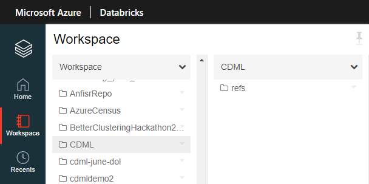

## Overview

ML Platform provides you with a repo with templates for AzureML pipelines, Xflow jobs, and Git-integrated Databricks notebooks. All these offerings are backed by CI/CD pipelines that run when you create PRs (Pull Requests) and make pushes to the `develop` and `master` branches of this repo.

## Get Started

**First, clone your repo from AzureDevOps to your devbox.**

1. Hit the "Clone" button on the top right of your AzureDevOps repo. Click the Copy icon next to your repo URL to copy it to your clipboard. 
2. Open PowerShell, Command Prompt, or your favorite terminal of choice.
3. See if you have Git installed by typing `git --version` and ensuring that a version is printed. If not, [click here](https://git-scm.com/downloads) to install Git and reload your terminal once it's installed.
4. Do the following in your terminal:
    ```
    cd to a place you want to store your Git repositories (ex: ~/Git/)
    git clone <paste your repo URL>
    ```

**Second, open your repo in VS Code.**

1. [Click here](https://code.visualstudio.com/) to install VS Code if you don't have it already.
2. Open VS Code. Click File -> Open Folder... -> point it to your cloned repo.

**Third, get famaliar with the repo structure:**

Here's a high level overview of the repo structure:
```
your repo
|
├───.build     <-- contains scripts that are used in the CI/CD pipeline
|
├───.pipelines <-- contains the code (.yml files) that define your CI/CD pipeline
|
└───src        <-- contains default templates and source code - add your code here!
    |
    └───MyProject <-- represents a project within src/
        |        
        ├───Databricks <-- contains the Databricks template
        |
        ├───AML_Pipeline <-- contains the AML Pipeline template
        |   |
        │   └───steps <-- contains Python script steps that are used in our AML Pipeline        
        |
        └───Xflow <-- contains the Xflow template
            |
            └────Scripts <-- contains SCOPE scripts
```

**Fourth, explore and edit the templates!**

The next few sections talk about each template and give you actionable steps to get started. You are free to edit the templates and CI/CD pipelines to your liking.

---

## AzureML Pipelines

**Main Idea: Within your repo, we provide a [few Python scripts](src/MyProject/AML_Pipeline/) to help you create/manage your AzureML workspace and then run pipelines within that workspace.**

### Get Started

See our [AML Beginner Walkthrough doc](src/MyProject/AML_Pipeline/README.md) to get started.

## Databricks Notebooks

**Main Idea: Within your repo, we provide a [sample Databricks notebook](src/MyProject/Databricks/) to help you get started with syncing Databricks notebooks between your Databricks workspace and repo.**

Whenever you make and push changes (add/edit/delete) to notebooks within your `Databricks/` folder, these changes are synced to the Databricks workspace configured in your CI/CD pipeline. By default, the Databricks workspace is [CDEDatabricksSouthCentral](https://southcentralus.azuredatabricks.net/?o=5794392664323572#).

### Get Started

- Go to your Databricks workspace, and you should see your repo name at the root level.
- Once you find your repo name, follow all the child folders (refs -> heads -> master) to see the example Databricks notebook that was pushed from your repo's `master` branch to Databricks. This means the folder structure in Databricks is `<your_repo>/refs/heads/<branch_name>`.
- When you make Databricks notebook changes (add/edit/delete) and push those changes to any branch (ex: `<your_alias>/<your_feature>`), the CI/CD pipeline will take care of pushing these changes to Databricks.

In the picture below, our example repo name is "CDML". 


## Canaveral/Xflow Jobs

**Main Idea: Within your repo, we provide a [sample Xflow job](src/MyProject/Xflow) that pushes sample Scope scripts to Xflow.**

Canaveral, a tool from the WDX (Windows, Developers, and Experiences) team, lets you deploy Xflow workflow right from the AzureDevOps Build (aka CI) process. It means that you no longer have to do a manual deployment of your Xflow workflows either using Xflow Web UI or using XflowConfig.exe to push .wfdef files. 

If you are planning to use Canaveral, please read this [Overview](https://microsoft.visualstudio.com/OSGData/_wiki/wikis/Canaveral/60268/Getting-Started) before you begin.

### Get Started

- Read the above documentation above to learn about Canaveral, the logic behind deploying workflows to Xflow.
- See our [Xflow Beginner Walkthrough doc](src/MyProject/Xflow/README.txt) to get started.