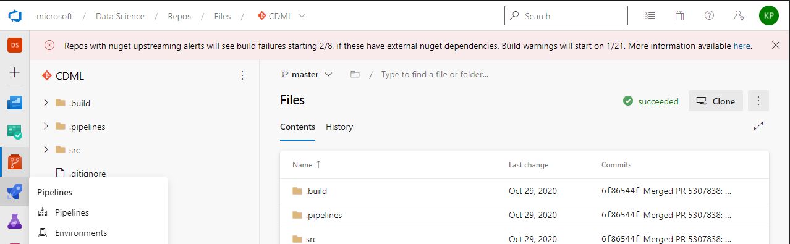
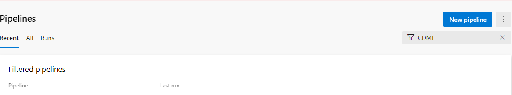
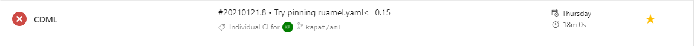
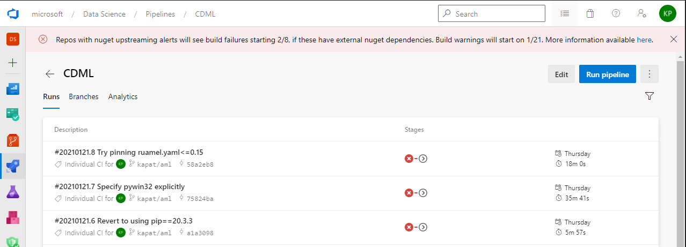
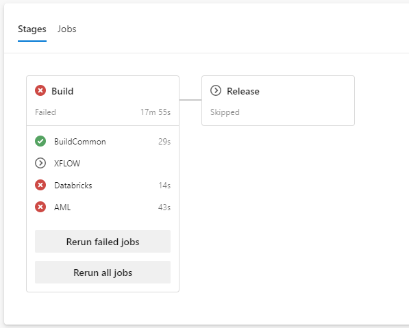
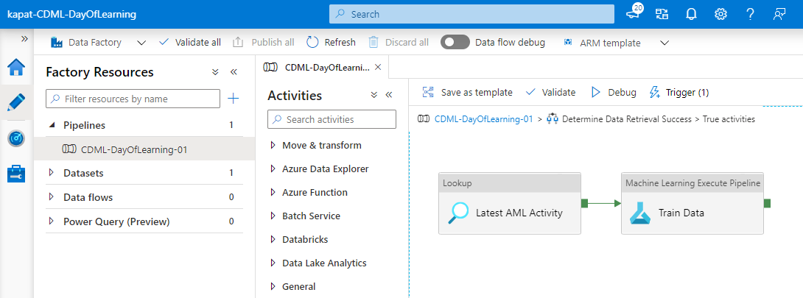

# The Hitchhikers Guide to AML (AzureML) Pipelines

The AML_Pipeline folder contains the basic resources you need to create your very first AML Workspace and Pipeline!

# Table of Contents

1. [The Idea](#the-idea)
2. [Set up your environment](#set-up-your-environment)
3. [Running your pipeline locally](#running-your-pipeline-locally)
4. [Defining your AML pipeline](#defining-your-aml-pipeline)
5. [Validating your AML pipeline](#validating-your-aml-pipeline)
6. [Submitting your pipeline as an AML experiment](#submitting-your-pipeline-as-an-aml-experiment)
7. [Publishing your AML pipeline](#publishing-your-aml-pipeline)
8. [Tired of Device Code Login?](#tired-of-device-code-login)
9. [Customizing your AML pipeline](#customizing-your-aml-pipeline)
10. [Making changes to your CI/CD Pipeline](#making-changes-to-your-cicd-pipeline)

---

## The Idea

The main reason we're giving you a starter AML pipeline is so that you don't have to start from scratch when transforming your experimental code to use AzureML.
With this start AML pipeline, you'll be able to do the following very easily:
1. Make changes to your experimental code (AKA pipeline logic)
2. Quickly test those changes on your devbox
3. Test those changes as part of an AML on an AML compute
4. If satisfied, publish your AML pipeline
5. Rinse and repeat

And you can do all these things by calling the driver script with different arguments, which we'll explain soon.

---

## Set up your environment

First, let's set up your environment. We will create one using virtualenv and install the required packages.

1. Open up a terminal (Recommended: PowerShell) and run the following commands:
    ```powershell
    cd to the AML_Pipeline/ folder
    easy_install pip
    pip install --upgrade pip==20.3.3
    pip install virtualenv
    virtualenv aml
    . .\aml\Scripts\activate.ps1
    pip install -r .\requirements.txt
    pip install --upgrade ischia-core --index-url https://microsoft.pkgs.visualstudio.com/_packaging/CoreData/pypi/simple/ --use-deprecated=legacy-resolver
    ```

    What we just did was:
    - Install pip if it's not installed already.
    - Create a virtual environment named "aml".
    - Activate the virtual environment.
    - Install the packages listed under requirements.txt.
    - Install the "ischia-core" Python package from a private Artifacts Feed. This is provided by ML Platform and installs AzureML for you.

2. Open VS Code and point it to open the AML_Pipeline folder (File -> Open Folder -> select  AML_Pipeline folder). This will ensure that your virtualenv is detected by VS Code.

3. Press F1 to bring up the Command Palette -> Type in "Python: Select Interpreter" and hit Enter. Select the environment that corresponds to the "aml" environment we created. The correct option is the one whose python path is ".\aml\Scripts\python.exe".

### Get famaliar with the folder structure

Here's an overview of the AML_Pipeline folder structure:
```
AML_Pipeline
|
├───steps
|   |
|   ├───components   <-- folder for our local Python module that contains pipeline logic
|   |   |
|   |   ├───__init__.py   <-- empty file that is required for our local Python module
|   |   |
|   |   ├───preprocess.py <-- contains pipeline logic for the preprocess step
|   |   |
|   |   └───train.py      <-- contains pipeline logic for the train step
|   |
|   ├───01_preprocess_step.py <-- 1st step in our AML pipeline, calls preprocess.py
|   |
|   └───02_train_step.py      <-- 2nd step in our AML pipeline, calls train.py
|
├───default_ischia_config.json   <-- used by ischia-core to define your AML resources
|
├───driver.py        <-- defines your AML pipeline, what you call
|
├───README.md        <-- the current document you're reading
|
└───requirements.txt <-- we installed the packages listed in this during env setup
```

---

## Running your pipeline locally

In your terminal, run the following command:
```
python driver.py --local
```
This prints some output which shows that some data is being preprocessed then trained on.

When you call the driver script (driver.py) with the `--local` flag, the driver script runs a few Python scripts on your local devbox:
1. From [preprocess.py](steps/components/preprocess.py), it calls `preprocess()`.
2. From [train.py](steps/components/train.py), it calls `train()`.

To see how it's done in code, open the driver script and look for this code snippet: 
```
from steps.components import preprocess, train

preprocess_output = preprocess.preprocess(use_test_dataset="True")
train.train(input=preprocess_output, outputs_folder="./", train_test_ratio=0.75)
```

These calls define your **pipeline logic**. Your pipeline logic is simply the code you want to run within your pipeline.

Notes:
- Being able to run your pipeline logic locally enables you to **quickly modify and test** your pipeline logic without having to submit runs to an AzureML remote compute.
- To better understand the code flow, feel free to add print statements to [preprocess.py](steps/components/preprocess.py), [train.py](steps/components/train.py), and the code in [driver.py](driver.py) that calls these two scripts.
- When you feel confident in your ability to make and test changes locally, you can learn how to submit your pipeline as an AML experiment.

Keep reading to learn more about AML concepts and submitting your pipeline as an AML experiment.

---

## Defining your AML pipeline

The entirety of your AML pipeline is defined within the [driver script (driver.py)](driver.py). Open it and read the description of each function.

As an overview, here is a breakdown of the functions from top to bottom:

Main functions:
- `run_local_pipeline()` - Called when you pass in the `--local` flag. (discussed above). 
- `run_aml_pipeline()` - Called when you DON'T pass in the `--local` flag. Uses AzureML to execute what you pass into `--action`.
- `run_aml_job()` - Called by `run_aml_pipeline()`. Figures out whether to publish your AML pipeline or submit it as an AML experiment.

Functions called by `run_aml_job()`:
- `get_or_create_compute()` - Defines the compute of your AML Pipeline.
- `create_pipeline_steps()` - Defines steps and data dependencies within your pipeline.
- `validate_pipeline()` - Always runs no matter what you pass in for `--action`. Validates your AML pipeline.
- `submit_experiment()` - Runs when you pass in `--action submit-experiment`. Submits your pipeline as an AML experiment.
- `publish_pipeline()` - Runs when you pass in `--action publish-pipeline`. Publishes your AML pipeline as an endpoint.

Other functions:
- `define_pipeline_parameters()` - Called by `submit_experiment()`. Defines pipeline parameters to use when submitting the pipeline as an AML experiment.

---

## Validating your AML pipeline

The driver file takes a few parameters to set up your AML Workspace and Pipeline. Run the following to see how all the parameters work:
```
python driver.py --help
```

**When you run the driver script for the first time, an AML Workspace will be created for you.** It will be created under the subscription, resource group, and region listed in the [Ischia config file (default_ischia_config.json)](default_ischia_config.json).

Once your workspace is created, it won't be created again; it will simply be fetched everytime you run the driver script. A new workspace is only created when you specify different parameters (ex: different workspace name or resource group).

> **IMPORTANT: It is HIGHLY recommend that you specify your repo name for the "--workspace_name" parameter.** The reason is because the CI/CD pipeline assumes that your workspace name is the same as your repo name. If you're choosing not to do this, please [click here to contact us](https://ischiadoc.azurewebsites.net/docs/contact/) so we can help you modify your CI/CD pipeline with your updated workspace name. 

### Steps

Run the driver script with the `validate` action to create our workspace and ensure that our template AML pipeline is valid.
```
python driver.py --workspace_name <your workspace name> --env <your alias/devbox name> --action validate

Ex: python driver.py --workspace_name my-aml-workspace --env kapatdevbox --action validate
```

On your local devbox, you will be asked to go through Device Code Login for authentication purposes.

Once you go through Device Code Login, the following will happen:
- An AML Workspace will be created with the name you provided.
- An AML Compute will be provisioned for your AML Workspace.
- Your AML pipeline consisting of two steps, `01_preprocess_step` and `02_train_step`, will be created and validated.

You should also see a message saying your pipeline is valid.

### AML Pipeline Concepts

- Steps - A pipeline consists of multiple steps. A step can be: running a Python script, running a Databricks notebook, copying data from Cosmos to ABS, etc.
  - For steps that run user-defined code, such as a `PythonScriptStep`, you must point the step to script you want to run. For example, check out the scripts that correspond to the two PythonScriptSteps in `create_pipeline_steps()`: 
    - `01_preprocess_step.py` - this calls `preprocess()` in [preprocess.py](steps/components/preprocess.py)
    - `02_train_step.py` - this calls `train()` in [train.py](steps/components/train.py)
  - When you chain multiple steps together, you must define that the output of one step is the input of another.
  - [Click here to see a list of steps.](https://docs.microsoft.com/en-us/python/api/azureml-pipeline-steps/azureml.pipeline.steps?view=azure-ml-py)
- Pipeline Parameters - These are parameters that are not static within pipelines. They can change from run to run. For example, these can be dates that you pass to your pipeline.

---

## Submitting your pipeline as an AML experiment

Once you validate your pipeline, you can finally submit your pipeline as an AML experiment. **Submitting your pipeline as an AML experiment is a way to unit test your pipeline end-to-end.**

### Steps

Run the driver script with the `submit-experiment` action:
```
python driver.py --workspace_name <your workspace name> --env <your alias/devbox name> --action submit-experiment

Ex: python driver.py --workspace_name my-aml-workspace --env kapatdevbox --action submit-experiment
```

Again, you may be asked to go through Device Code Login. Once you go through Device Code Login, your AML workspace will be fetched and your pipeline will be submitted as an experiment to the AML workspace.

**You'll get a link to the AML experiment. Click the link to check out your run.**

For each step within your run, click on the step itself then look at its "Outputs + logs". Click on "azureml-logs" -> "70_driver_log.txt" to see the print statements for that step. This file is typically what we use to debug the output of each step when there are failures in the pipeline.

After a while, you'll get a message in your terminal saying the AML experiment completed successfully.

**Once your AML experiment completes, you can see your registered model at the Models sections on your AML Workspace page.**

---

## Publishing your AML pipeline

**Publishing your AML pipeline means you are creating an endpoint for your pipeline to be consumed by other resources.** For example, a common scenario is to publish your pipeline and tell Azure Data Factory to schedule runs to the published pipeline.

```
python driver.py --workspace_name <your workspace name> --env <your alias/devbox name> --action publish-pipeline

Ex: python driver.py --workspace_name my-aml-workspace --env kapatdevbox --action publish-pipeline
```

Once the driver file runs, you'll see a GUID at the very end. You can specify this GUID to Azure Data Factory within the "Execute ML Activity" task.

---

## Tired of Device Code Login?

The [default Ischia config file (default_ischia_config.json)](default_ischia_config.json) uses your credentials to access AML resources. However, this requires you to enter a Device Code each time. Keep reading to enable Ischia to bypass Device Code login and use Service Principal credentials instead.

### Context

The "auth" section of the Ischia config file is designed to use a Service Principal (which consists of a `client_id` and `client_secret`) to interact with your AML resources. However, it is VERY bad practice to specify a `client_secret` in plain text, so the rest of the "auth" section gives details on retrieving the `client_secret`.

The "auth" section in your Ischia config file looks like this:
```
"auth": {
    "client_id": "8800ccd2-c5ae-49df-b209-de1d47f507a8",
    "env_secret_name": "MyOptionalEnvVarFor8800ClientSecret",
    "keyvault_url": "https://cosinedatateamkeyvault.vault.azure.net/",
    "keyvault_secret_name": "adls-asimov-prod-data-c15-serviceprincipalkey"
}
```

The `client_id` parameter specifies the Client ID of your Service Principal. In our case, the Service Principal listed is "8800ccd2-c5ae-49df-b209-de1d47f507a8".

The `keyvault_url` and `keyvault_secret_name` parameters work together to obtain a secret from the KeyVault to act as the client secret of the Service Principal. This causes Device Code login to happen because your credentials are used to access the KeyVault.

**Important:** The `env_secret_name` parameter looks for a secret in your local devbox Environment Variables. However, this doesn't work because we haven't added the client secret to our Environment Variables yet. This is what we will do.

### Steps to Take

To stop doing Device Code Login everytime, you can do the following:
1. Decide what Service Principal to use for accessing your AML Workspace.
    > The value of `auth["client_id"]` in your Ischia config file specifies the Service Principal you're using. You can either use the default one (starts with 8800) or replace the value with the Client ID of your chosen Service Principal.
2. Put the Client Secret of your chosen Service Principal in the Environment Variables of your local devbox. Take the following steps:
    - Windows:
        - Hit the Windows key then type "env".
        - Select the "Edit the system environment variables" option.
        - Click the "Environment Variables..." button on the bottom.
        - Click the "New" button under the "System variables" section.
        - This is where you fill in "MyOptionalEnvVarFor8800ClientSecret" for Variable name and the Client Secret for Variable value.
        - Click "Ok" to add the environment variable then "Ok" again to close the Environment Variables pop-up.
    - Linux:
        - Open your .bashrc file in your favorite editor (nano, vim, etc.): `nano ~/.bashrc`.
        - At the very end of the file, add the environment variable using this format: `export [VARIABLE_NAME]=[variable_value]`
        - This is where you type `export MyOptionalEnvVarFor8800ClientSecret="ClientSecretValueGoesHere"`
        - Save the .bashrc file and reload your terminal.
        - Double-check that the environment variable was saved by running `echo $MyOptionalEnvVarFor8800ClientSecret`, which should print the Client Secret value.
    > If you're not sure how to obtain the Client Secret, please [click here to contact us](https://ischiadoc.azurewebsites.net/docs/contact/).
3. In your Ischia config file, double check that the value of the `auth["env_secret_name"]` parameter is the same as the Secret name in your local devbox Environment Variables. For example:
    - In your Ischia config file, you should see this:
        ```
        "env_secret_name": "MyOptionalEnvVarFor8800ClientSecret"
        ```
    - Therefore, you should ensure that the Variable name in your Environment Variables is also called "MyOptionalEnvVarFor8800ClientSecret".

With these changes, you can run the driver script without doing Device Code Login.

Note: You may need to reload your terminal for the added Environment Variable to take effect.

---

## Customizing your AML pipeline

Now that you know the basics, you can edit your pipeline to fit your liking.

For example, you can:
- run your AML Pipeline with a [Databricks compute](https://docs.microsoft.com/en-us/python/api/azureml-pipeline-steps/azureml.pipeline.steps.databricksstep?view=azure-ml-py#definition)
- define dependencies for [data in Cosmos/ADLS](https://docs.microsoft.com/en-us/python/api/azureml-pipeline-core/azureml.pipeline.core.builder.pipelinedata?view=azure-ml-py)

For examples on both these scenarios and more, check out this [more advanced driver file](https://microsoft.visualstudio.com/Data%20Science/_git/CDEML?path=%2FTemplates%2FSource%2FAzureMLPipeline_Driver%2Fcreate_azureml_pipeline_train.py).

---

## Making changes to your CI/CD Pipeline

### Context 

CI/CD stand for Continuous Integration and Continuous Delivery.

The CI part translates to a Build stage that ensures your code is valid by running unit and integration tests.

The CD part translate to a Release stage that releases your artifacts to various platforms, such as an Artifacts Feed, App Service, etc.

For AzureML, we call the `validate` action in the Build stage and the `publish-pipeline` action in the Release stage.

### Seeing your CI/CD pipeline in AzureDevOps

1. First, Go to your repo in AzureDevOps. On the left hand side, click on the Rocket icon to be taken to the Pipelines page. 

2. On the Pipelines page, search for your repo name in the "Filter pipelines" search bar. 

3. Once you find your repo listed, click on it.

4. This page shows you all the CI/CD pipeline runs for your repo.

5. Click on a run to see which tasks ran for the Build and Release stages.

6. If you click on the AML task within the Build Stage, you'll see what commands were called within the task. You should find the "python driver.py ..." call at the bottom of the task output.

### Making changes

The AML task within the CI/CD pipeline is specified within the .pipelines/templates/amlBuild.yml file in your repo.

[Click here to open amlBuild.yml](../../../.pipelines/templates/amlBuild.yml)

Inside of this file, you'll notice the `python driver.py ...` call. In this call, you will notice a few things:
- `--workspace_name $env:REPO`
    - This is the parameter that allows the CI/CD pipeline to assume that your AzureML Workspace name is the same as your repo name.
    - **If this is not the case, please change `$env:REPO` to your AML Workspace name.**
- `--publish_datastore_path 'cdml_aml_pipelines/markers'`
    - This is the parameter that enables the driver script to create a CSV file to your Published Pipeline ID whenever it is ran with `--action publish-pipeline`.
    - This CSV file can be consumed by something like Azure Data Factory, like so:
    
    - All you need to do to enable this flow is use the Lookup activity in ADF and point to the CSV file within your AML-connected Datastore. If you need help with this, please contact us and we'd be happy to help.

If you need any help modifying your CI/CD pipeline, please [click here to contact us](https://ischiadoc.azurewebsites.net/docs/contact/) so we can help you. 